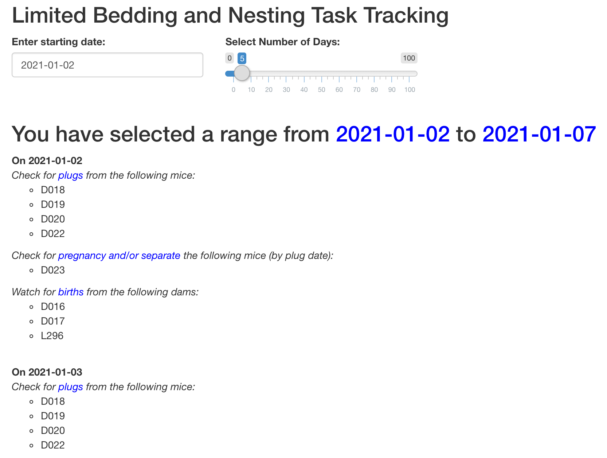

# app.R - Shiny APP
[Return to Main README](../README.md)

Shiny App is a web application builder that uses R to make interactive designs. It creates an HTML webpage, and there are R functions that create these HTML elements. 

The Shiny App is comprised of two components - the UI and the Server. The UI defines the "look" of the app and where the different elements should be placed. The Server handles the calculations necessary to produce the graphs, tables, and other elements of the application.

When writing the Shiny app, there is a "global" portion of the code outside of the UI and server pieces that only gets run once when the application loads. There is where the data will generally be imported, and where you should source any module files that describe the different components of the application. 

The application can be separated into different pages and tabs. For this application, there are currently three pages: **Tasks**, **Data**, and **Analysis**. 

## Tasks
[Read about the Task Tracking Module here](./appR_Modules/taskTrackingModule.md)

This panel displays the actions that need to be taken for this project on a given day, such as taking masses or setting up the paradigm. This is helpful for keeping track of many different cages with different DOBs.

## Data
[Read about the Raw Data Module here](./appR_Modules/rawDataModule.md)

This panel displays the data frames with the raw data for the dams and offspring.

## Analysis
The analysis module has the graphs for data analysis for different components of the project. It also allows for filtering the data based on birth date (for different cohorts), dam strain, and paradigm dates (P2-P9 vs P4-P11). 

### Dams
There are three subpanels for the dam data analysis. 

#### Dam Mass
[Read about the Dam Mass Module here](./appR_Modules/massDamModule.md)

#### Pup Loss
[Read about the Pup Loss Module here](./appR_Modules/pupLossModule.md)

#### Corticosterone
[Read about the Dam Corticosterone Module here](./appR_Modules/damCortModule.md)

### Offspring Mass
[Read about the Offspring Mass Module here](./appR_Modules/massOffModule.md)

### Offspring Maturation
[Read about the Offspring Maturation Module here](./appR_Modules/maturationOffModule.md)

This panel shows the cumulative frequency plots for the day of preputial separation, vaginal opening, and first estrus. There are also summary tables for each phenotype.

### Acute Stress Paradigm
[Read about the Acute Stress Module here](./appR_Modules/acuteStresModule.md)

This sections describes the response to the acute stress paradigm during adulthood. The graph has not yet been coded, but the table is provided.

### Offspring Cycles
[Read about the Offspring Cycles Module here](./appR_Modules/cyclesModule.md)

This panel displays the estrous cycle graphs for the control and LBN female offspring in adulthood.